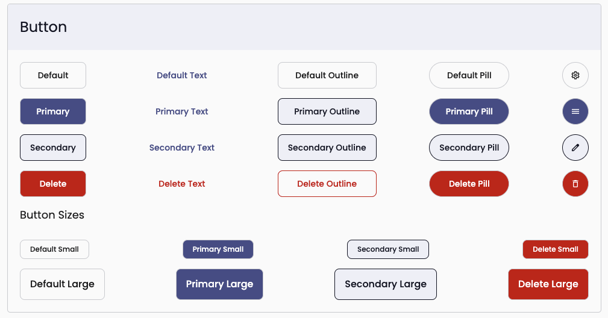

# Button Component

## Look



## Usage

Button classes can be used on `button` or `a` html elements.
They provide consistent and composable styling that should address most applications basic needs.

`.btn` Provides a default outlined black text button. This would be commonly used as a cancel button in a form.
```html
<button class='btn'>Default</button>
```

`.btn-primary` Provides a filled button using the primary color in your theme. This should be used as the primary action on a screen such as the login button on an account screen or the submit button on a form.
```html
<button class='btn-primary'>Primary</button>
```

`.btn-secondary` Provides an outlined button using the primary color in your theme. This should be used as a secondary action on a screen such as the create account button on a login screen.
```html
<button class='btn-secondary'>Secondary</button>
```

`.btn-delete` Provides a filled button using the red danger color. This should be used as a destructive action such as delete.
```html
<button class='btn-delete'>Delete</button>
```

`.btn--outline` This is a modifier which can be used with all button classes. It provides an outlined button that adapts it's color to all the btn variations.
```html
<button class='btn btn--outline'>Outline</button>
<button class='btn-delete btn--outline'>Outline Delete</button>
```

`.btn--text` This is a modifier which can be used with all button classes. It provides a text only button with the same sizing and adapts it;s color to all the btn variations.
```html
<button class='btn btn--text'>Text</button>
<button class='btn-delete btn--text'>Text Delete</button>
```

`.btn--disabled` Should be used on `a` elements that need to be disabled. `button` elements can use the `disabled` attribute as well as this class. This makes the button opaque and changes the cursor to the `not allowed` icon.
```html
<button class='btn-primary btn--disabled' disabled>Disabled Primary</button>
<a class='btn-delete btn--disabled'>Disabled Delete</button>
```

`.btn--pill` Modifies the shape of any other buttons by adding a radius to the left and right.
```html
<button class='btn-primary btn--pill'>Pill Primary</button>
<a class='btn-delete btn--pill'>Pill Delete</button>
```

`.btn--icon` Modifies the shape of any other button class by adding a full radius to the button. This should only be used with an icon as the button text.
```html
<button class='btn-primary btn--circle'>👍</button>
```

`.btn--small` Modifies the size of any other button class by changing the font and height to be smaller.
```html
<button class='btn-primary btn--small'>Small</button>
```

`.btn--medium` Modifies the size of any other button class by changing the font and height to be the default size. This would mainly be used as an override if you need to reset the size for some reason.
```html
<button class='btn-primary btn--medium'>Medium</button>
```

`.btn--large` Modifies the size of any other button class by changing the font and height to be larger.
```html
<button class='btn-primary btn--large'>Large</button>
```

## Custom Button

If your application needs a new custom button, you can add it by creating a button class like `.btn-something`, defining how it behaves with the outline `.btn-something.btn--outline`, and defining how it behaves with the text `.btn-something.btn--text`. The other modifiers will automatically work with it. You can use `.btn-delete` as an example of how this would work.
