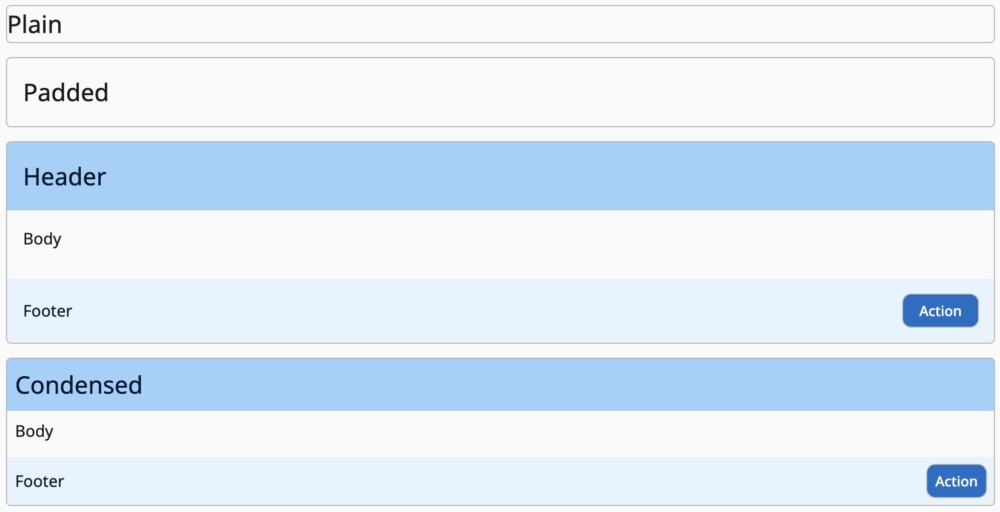

# Card Components

## Look



## Usage

Card classes can be used to denote bordered sections of an application. They provide simple styles to create sections or "cards" for your interface. They can also be used as a starting point for "row" or list styles.

`.card` Provides basic card styles.
```html
<div class='card'>
  ...
</div>
```

`.card-padded` Provides a padded card.
```html
<div class='card-padded'>
  ...
</div>
```

`.card__header`, `.card__body`, and `.card__footer` Provide padded sections of a card.
```html
<div class='card'>
  <div class='card__header'></div>
  <div class='card__body'></div>
  <div class='card__footer'></div>
</div>
```

`.card--condensed` Changes the padding scale for everything below it.
```html
<div class='card card--consensed'>
  <div class='card__header'></div>
  <div class='card__body'></div>
  <div class='card__footer'></div>
</div>
```
