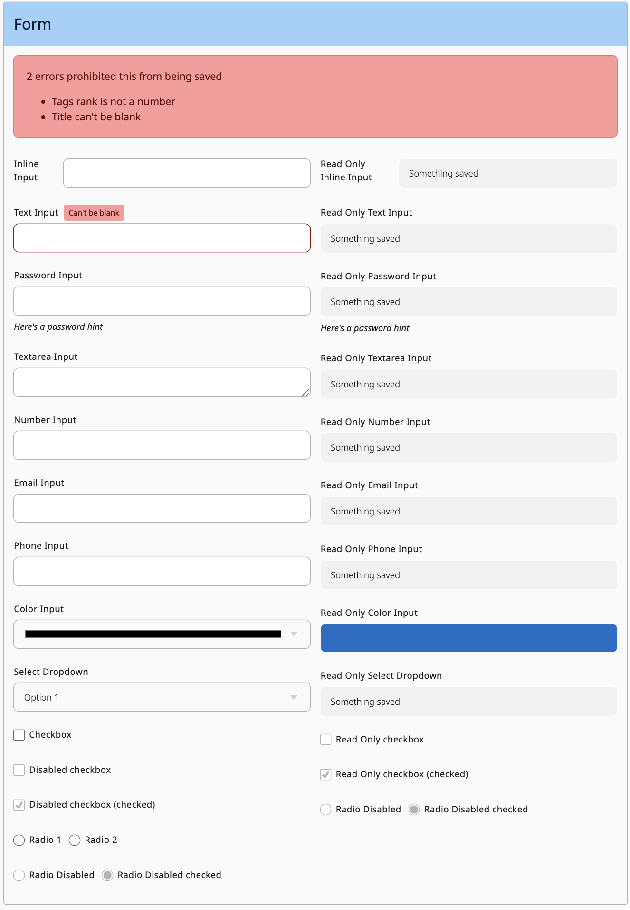

# Form Components

## Look



## Usage

Form classes can be used on a variety of `inputs` or `select` html elements.
They provide consistent and composable styling that should address most applications basic needs.

`.form__label` Provides basic input label styles.
```html
<label class='form__label'>A Label</label>
```

`.form__input` Provides basic input styles. This can be used on `input` html elements. It works across a variety of types such as `text`, `number`, `password`, `email`, and `phone`
```html
<input type='text' class='form__input' />
```

`.form__group` Composes an input and label together as a pair. It provides padding between input + label pairs in a form.
```html
<div class='form__group'>
  <label class='form__label'>Text Input</label>
  <input type='text' class='form__input' />
</div>
```

`.form__inline-group` Composes an input and label together as a side by side pair. It can be used with `form__group` to get padding as well as side by side label and input.
```html
<div class='form__group form__inline-group'>
  <label class='form__label'>Text Input</label>
  <input type='text' class='form__input' />
</div>
```

`.form__textarea` Provides basic text area styles. This can be used on `textarea` html elements.
```html
<textarea class='form__textarea' />
```

`.form__dropdown` Provides basic `select` element styles.
```html
<select class='form__dropdown'>
  <option>Option 1</option>
  <option>Option 2</option>
  <option>Option 3</option>
</select>
```

`.form__color` Provides basic color input styles. This can be used on `input` html elements with a type of `color`.
```html
<input type='color' class='form__color' />
```

`.form__radio` Provides basic input of type `radio` styles.
```html
<div class='form__group'>
  <input class='form__radio' id='radio-1' type='radio' name='radio' value='1' />
  <label class='form__label' for='radio-1'>Radio 1</label>

  <input class='form__radio' id='radio-2' type='radio' name='radio' value='2' />
  <label class='form__label' for='radio-2'>Radio 2</label>
</div>
```

`.form__checkbox` Provides basic input of type `radio` styles.
```html
<div class='form__group'>
  <input class='form__checkbox' id='checkbox' type='checkbox' />
  <label class='form__label' for='checkbox'>Checkbox</label>
</div>
```

`.form__error-summary` Is an error section, usually displayed above the form with a list of errors.
```html
<div class='form__error-summary'>
  <h2>2 errors prohibited this from being saved</h2>
  <ul>
    <li>Tags rank is not a number</li>
    <li>Title can't be blank</li>
  </ul>
</div>
```

`.form__input--error` and `.form__error` are typically used on combination when there is a validation error on an input. They highlight the input in error along with the message provided.
```html
<div class='form__group form__input--error'>
  <label class='form__label'>Text Input</label>
  <span class='form__error'>Can't be blank</span>
  <input class='form__input' type='text' />
</div>
```

`.form__hint` can be used inside of a `form__group` to provide help text for an input.
```html
<div class='form__group'>
  <label class='form__label'>Password Input</label>
  <input class='form__input' type='password' />
  <span class='form__hint'>Here's a Password Hint</span>
</div>
```

`.form__input--read-only`, `.form__dropdown--read-only`, `.form__color--read-only`, and `.form__textarea--read-only` can be used to display values in a form-like way.
```html
<div class='form__group'>
  <label class='form__label'>Password Input</label>
  <span class='form__input form__input--read-only'>Saved Value</span>
</div>
```
