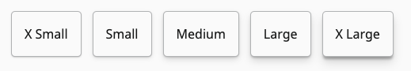

# Shadow Utilities

## Look




## Usage

Shadow utility classes can be used to add elevation to elements. Theyprovide a simple box shadow style that can be composed with other box shadow variables such as the borders.

`.shadow-x-small` Provides an extra small shadow on any element. It also handles stacking with bordered cards
```html
<div class='card shadow-x-small'>
  ...
</div>
```

`.shadow-small` Provides a small shadow on any element. It also handles stacking with bordered cards
```html
<div class='card shadow-small'>
  ...
</div>
```

`.shadow-medium` Provides a medium shadow on any element. It also handles stacking with bordered cards
```html
<div class='card shadow-medium'>
  ...
</div>
```

`.shadow-large` Provides a large shadow on any element. It also handles stacking with bordered cards
```html
<div class='card shadow-large'>
  ...
</div>
```

`.shadow-x-large` Provides a x-large shadow on any element. It also handles stacking with bordered cards
```html
<div class='card shadow-x-large'>
  ...
</div>
```
