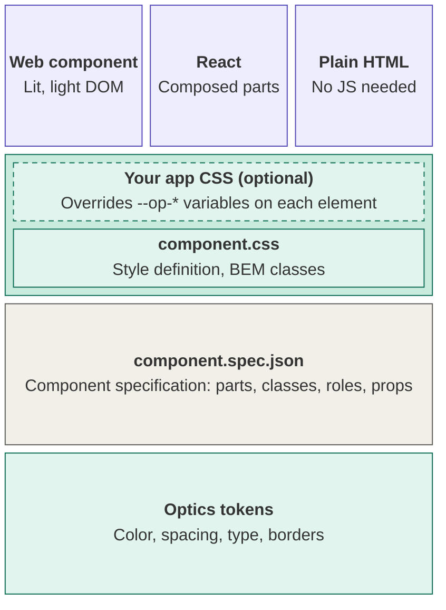

# Component layers

```mermaid
block-beta
  columns 3
  wc["<b>Web component</b><br/>Lit, light DOM"] react["<b>React</b><br/>Composed parts"] html["<b>Plain HTML</b><br/>No JS needed"]
  block:styles:3
    columns 1
    app["<b>Your app CSS (optional)</b><br/>Overrides --op-* variables on each element"]
    css["<b>component.css</b><br/>Style definition, BEM classes"]
  end
  spec["<b>component.spec.json</b><br/>Component specification: parts, classes, roles, props"]:3
  tokens["<b>Optics tokens</b><br/>Color, spacing, type, borders"]:3

  classDef styleLayer fill:#E1F5EE,stroke:#0F6E56,color:#085041
  classDef optional fill:#E1F5EE,stroke:#0F6E56,color:#085041,stroke-dasharray:5 4
  classDef contract fill:#F1EFE8,stroke:#5F5E5A,color:#444441
  classDef version fill:#EEEDFE,stroke:#534AB7,color:#3C3489

  class wc,react,html version
  class app optional
  class css,tokens styleLayer
  class spec contract
  style styles fill:#C9EBDD,stroke:#0F6E56
```
