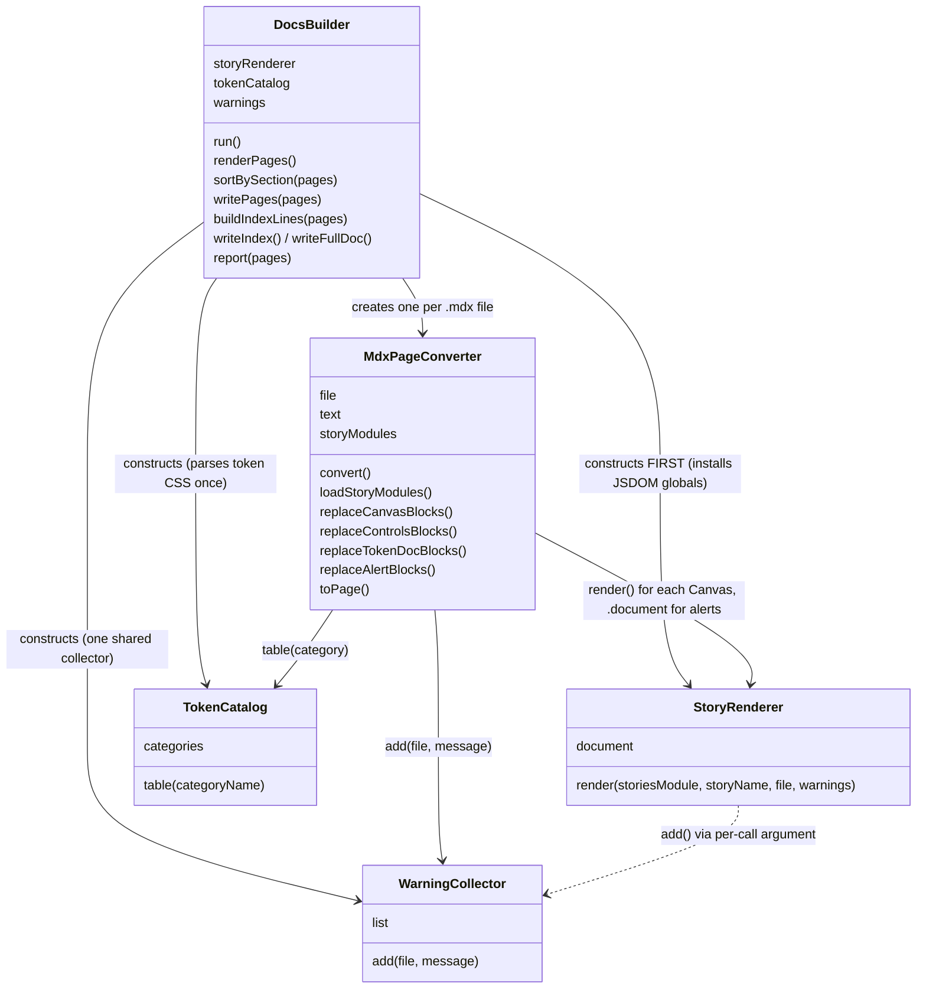
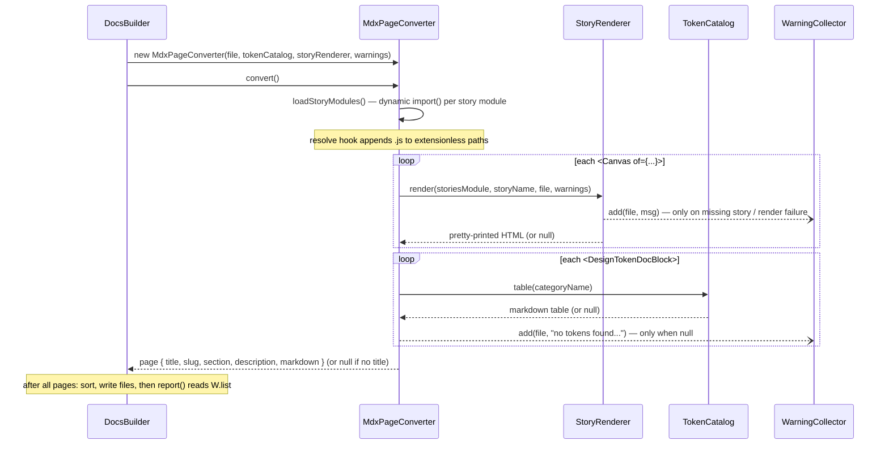

# build-llms-docs architecture

How the classes in [`build-llms-docs.mjs`](build-llms-docs.mjs) communicate. See the
header comment in the script for what the tool produces; this covers how the pieces fit
together.

## Class relationships

## Runtime flow for one page (`convert()`)

## Notes

- Everything is wired by constructor injection from `DocsBuilder` — it owns the three
  singletons (`StoryRenderer`, `TokenCatalog`, `WarningCollector`) and hands them to each
  per-page `MdxPageConverter`. No class reaches for module-level state except the path
  constants.
- Construction order matters: `StoryRenderer`'s constructor installs the JSDOM globals
  that story modules use at import time, so `DocsBuilder` builds it before the first
  converter runs `loadStoryModules()`. The converter's alert handling also uses
  `storyRenderer.document` (the dashed dependency above).
- `WarningCollector` is the one shared sink: converters hold it as a field, while
  `StoryRenderer.render` receives it per call (rendering needs the page's file path for
  the message). `DocsBuilder.report()` reads the accumulated list at the very end, which
  is why warning *order* is load-bearing.
- Module-level pure helpers (`resolveStory`, `controlsTable`, `markdownTable`, `walk`,
  etc.) are left off the diagrams — they're stateless functions, not communicating
  objects.
