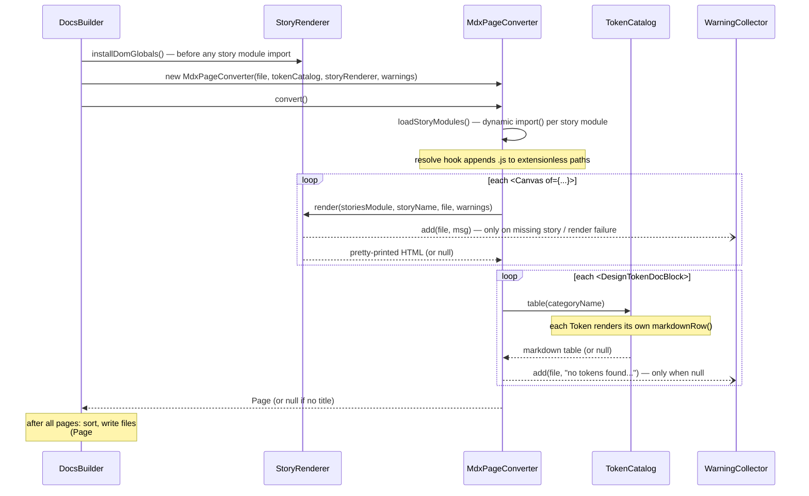

# build-llms-docs architecture

How the classes in [`build-llms-docs.mjs`](build-llms-docs.mjs) communicate. See the
header comment in the script for what the tool produces; this covers how the pieces fit
together.

## Class relationships

```mermaid
classDiagram
    class DocsBuilder {
        storyRenderer
        tokenCatalog
        warnings
        run()
        renderPages()
        sortBySection(pages)
        writePages(pages)
        buildIndexLines(pages) / indexHeader()
        writeIndex() / writeFullDoc()
        report(pages)
    }
    class MdxPageConverter {
        file
        text
        storyModules
        convert()
        loadStoryModules()
        replaceCanvasBlocks() / canvasCodeBlock()
        replaceAlertBlocks() / alertBlockquote()
        replaceControlsBlocks()
        replaceTokenDocBlocks()
        toPage()
    }
    class Page {
        title
        slug
        section
        description
        markdown
        indexEntry()
        fullDocEntry()
    }
    class StoryRenderer {
        document
        installDomGlobals()
        shimInnerText(window)
        render(storiesModule, storyName, file, warnings)
        prettyPrint(html)
    }
    class TokenCatalog {
        categories: name -> Token[]
        parseTokenCss(css)
        addTokens(category, declarations)
        table(categoryName)
    }
    class Token {
        name
        value
        markdownRow()
    }
    class WarningCollector {
        list
        add(file, message)
        report()
    }

    DocsBuilder --> StoryRenderer : run() calls installDomGlobals() FIRST
    DocsBuilder --> TokenCatalog : constructs (parses token CSS once)
    DocsBuilder --> WarningCollector : constructs; report() at the end
    DocsBuilder --> MdxPageConverter : creates one per .mdx file
    DocsBuilder --> Page : sorts; collects indexEntry()/fullDocEntry()
    MdxPageConverter --> StoryRenderer : render() for each Canvas, .document for alerts
    MdxPageConverter --> TokenCatalog : table(category)
    MdxPageConverter --> WarningCollector : add(file, message)
    MdxPageConverter --> Page : toPage() creates
    StoryRenderer ..> WarningCollector : add() via per-call argument
    TokenCatalog o-- Token : one per declaration; table() collects markdownRow()s
```

## Runtime flow for one page (`convert()`)



## Notes

- Everything is wired by constructor injection from `DocsBuilder` — it owns the three
  singletons (`StoryRenderer`, `TokenCatalog`, `WarningCollector`) and hands them to each
  per-page `MdxPageConverter`. No class reaches for module-level state except the path
  constants.
- Ordering matters: story modules build DOM nodes via browser globals at import time, so
  `run()` calls `storyRenderer.installDomGlobals()` before the first page conversion
  triggers a dynamic import. The converter's alert handling also uses
  `storyRenderer.document` (the dashed dependency above).
- `WarningCollector` is the one shared sink: converters hold it as a field, while
  `StoryRenderer.render` receives it per call (rendering needs the page's file path for
  the message). `DocsBuilder.report()` delegates to `warnings.report()` at the very end,
  which is why warning *order* is load-bearing.
- `Page` and `Token` are value objects. A `Page` (created by `MdxPageConverter.toPage()`)
  knows its own slug, section, and description, and renders its own index and full-doc
  entries — `DocsBuilder` only sorts pages and concatenates what they produce. A `Token`
  is owned entirely by `TokenCatalog`; the rest of the build only sees
  `table(categoryName)`'s finished markdown (or `null`).
- Every pattern a class matches against is a named `static` field on that class —
  `MdxPageConverter` declares one regex per transform method (`CANVAS_BLOCK`,
  `ALERT_BLOCK`, `TOKEN_DOC_BLOCK`, ...), `TokenCatalog` its three CSS-annotation
  patterns, and `StoryRenderer` its class-name cleanup regex and prettier options.
- Module-level pure helpers (`resolveStory`, `controlsTable`, `markdownTable`, `walk`,
  etc.) are left off the diagrams — they're stateless functions, not communicating
  objects.
